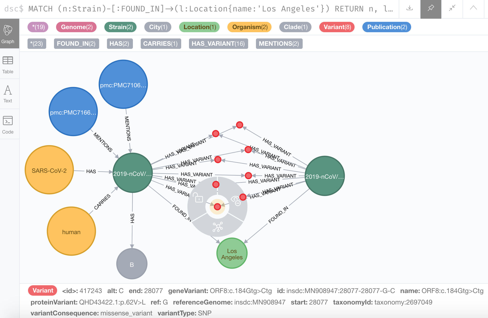

# Covid-19-Community

This project is a community effort to build a Neo4j Knowledge Graph (KG) that links heterogenous data about COVID-19 to help fight this outbreak! It serves as a sandbox and incubator project and the best ideas will be incorporated into the Covid-19-Net KG.

Join **"GraphHackers, Let’s Unite to Help Save the World — [Graphs4Good 2020](https://medium.com/neo4j/graphhackers-lets-unite-to-help-save-the-world-graphs4good-2020-fed53562b41f)"**.

What kind of data can you contribute? Here are some ideas:


## How can you contribute?

* File an [issue](https://github.com/covid-19-net/covid-19-community/issues/new) to discuss your idea so we can coordinate efforts
* Help with [specific issues](https://github.com/covid-19-net/covid-19-community/labels/help%20wanted)
* Suggest publically accessible data sets
* Add Jupyter Notebooks with data analyses, maps, and visualizations
* Report bugs or issues

## Preliminary Knowledge Graph Schema


The left side of the schema shows the geolocation hierarchy from the world to the city level (> 1000 citizens). The right side shows COVID-19 case counts and information about the host organisms, virus strains, genes, proteins, protein-protein interactions, and publications. Cases and Strains are linked to geolocations. The node NodeMetadata describes nodes in the Knowledge Graph and links to relevant ontologies (e.g., Infectious Disease Ontology).

## Browse the Knowledge Graph with the Neo4j Browser

**The Knowledge Graph is updated daily at 07:00 UTC.**


View of Neo4j Browser showing the result of a query about interactions of the Spike glycoprotein with human host proteins and related publications in PubMedCentral.

You can browse the Knowledge Graph here:

[](http://132.249.238.185:7474/)

1. Enter *username:* reader, *password:* demo
2. Click on the database icon on the top left, then click on any node label to start exploring the KG
3. Try to run a Cypher query (see [introduction to Cypher](https://neo4j.com/docs/cypher-manual/current/introduction/)

#### Example Cypher query: find viral strains collected in Los Angeles
```
MATCH (s:Strain)-[:FOUND_IN]->(l:Location{name: 'Los Angeles'}) RETURN s, l
```


This subgraph shows two viral strains (green) of the [SARS-CoV-2 virus](https://www.ncbi.nlm.nih.gov/Taxonomy/Browser/wwwtax.cgi?id=2697049) carried by a [human](https://www.ncbi.nlm.nih.gov/Taxonomy/Browser/wwwtax.cgi?id=9606) host in Los Angeles (organisms in yellow). The strains have several variants (e.g., mutations)(red) in common. Details of the high-lighted variant is shown at the bottom. This variant is a [missense mutation](https://en.wikipedia.org/wiki/Missense_mutation): the base "G" ([Guanine](https://en.wikipedia.org/wiki/guanine)) found in the [Wuhan-HU-1 reference genome](https://www.ncbi.nlm.nih.gov/nuccore/MN908947.3) was mutated to a "C" ([Cytosine](https://en.wikipedia.org/wiki/cytosine)) at position 28077 in this strain (ORF8:c.184Gtg>Ctg), resulting in the encoded ORF8 protein ([QHD43422.1](https://www.ncbi.nlm.nih.gov/protein/1791269096)) to be changed from a "V" ([Valine](https://en.wikipedia.org/wiki/Valine)) to an "L" ([Leucine](https://en.wikipedia.org/wiki/Leucine)) amino acid at position 62 (QHD43422.1:p.62V>L). Two publications: [PMC7166309](https://www.ncbi.nlm.nih.gov/pmc/articles/PMC7166309/) and [PMC7106203](https://www.ncbi.nlm.nih.gov/pmc/articles/PMC7106203/) (blue) mention this strain.

#### Example Cypher query: aggregate cummulative COVID-19 case numbers at the US state (Admin1) level
```
MATCH (o:Outbreak{id: "COVID-19"})<-[:RELATED_TO]-(c:Cases{date: date("2020-05-04")})-[:REPORTED_IN]->(a:Admin2)-[:IN]->(a1:Admin1)
RETURN a1.name as state, sum(c.cummulativeConfirmed) as confirmed, sum(c.cummulativeDeaths) as deaths
ORDER BY deaths DESC;
```

Note, some cases in the COVID-19 Data Repository by Johns Hopkins University cannot be mapped to a county or state location (e.g., correctional facilities, missing location data). Therefore, the results of this query will underreport the actual number of cases.

## Query the Knowledge Graph in Jupyter Notebook
Cypher queries can be run in Jupyter Notebooks to enable reproducible data analyses and visualizations.

You can run the following Jupyter Notebooks in your web browser:

[](https://aws-uswest2-binder.pangeo.io/v2/gh/covid-19-net/covid-19-community/master?urlpath=lab)

Once Jupyter Lab launches, navigate to the `notebooks/queries` directory and run the following notebooks:

|Notebook|Description|
|:-------|:----------|
|[3-ExampleQueriesBioentities](notebooks/queries/3-ExampleQueriesBioentities.ipynb)| Runs example queries on the Knowledge Graph|
|...|add examples here ...|

## Data Download and Preparation
The following notebooks download, clean, and standardize data in the form of .csv files for ingestion into the Knowledge Graph. The prepared data files are saved in the `NEO4J_HOME/import` directory and cached intermediate files are saved in the `NEO4J_HOME/import/cache` directory. The Knowledge Graph is updated daily at 07:00 UTC by running the [update script](scripts/update_kg.sh).

|Notebook|Description|
|:-------|:----------|
|[00e-GeoNamesCountry](notebooks/dataprep/00e-GeoNamesCountry.ipynb)| Downloads country information from GeoNames.org|
|[00f-GeoNamesAdmin1](notebooks/dataprep/00f-GeoNamesAdmin1.ipynb)| Downloads first administrative divisions (State, Province, Municipality) information from GeoNames.org|
|[00g-GeoNamesAdmin2](notebooks/dataprep/00g-GeoNamesAdmin2.ipynb)| Downloads second administrative divisions (Counties in the US) information from GeoNames.org|
|[00h-GeoNamesCity](notebooks/dataprep/00h-GeoNamesCity.ipynb)| Downloads city information (cities > 1000 citizens) from GeoNames.org|
|[00i-USCensusRegionDivisionState2017](notebooks/dataprep/00i-USCensusRegionDivisionState2017.ipynb)| Downloads US regions, divisions, and assigns state FIPS codes from the US Census Bureau|
|[00j-USCensusCountyCity2017](notebooks/dataprep/00j-USCensusCountyCity2017.ipynb)| Downloads US County FIPS codes from the US Census Bureau|
|[00k-UNRegion](notebooks/dataprep/00k-UNRegion.ipynb)| Downloads UN geographic regions, subregions, and intermediate region information from United Nations|
|[01a-NCBIStrain](notebooks/dataprep/01a-NCBIStrain.ipynb)| Downloads the SARS-CoV-2 strain data from NCBI |
|[01b-Nextstrain](notebooks/dataprep/01b-Nextstrain.ipynb)| Downloads the SARS-CoV-2 strain metadata from Nextstrain|
|[01c-NCBIRefSeq](notebooks/dataprep/01c-NCBIRefSeq.ipynb)| Downloads the SARS-CoV-2 reference genome, genes, and protein products from NCBI|
|[01d-CNCBStrain](notebooks/dataprep/01d-CNCBStrain.ipynb)| Downloads SARS-CoV-2 viral strains and variation data from CNCB (China National Center for Bioinformation) [takes about 12 hours to run the first time, results are cached]|
|[01d-CNCBStrainLocations](notebooks/dataprep/01d-CNCBStrainLocations.ipynb)| Standardizes locations for variation data from CNCB (China National Center for Bioinformation) |
|[01e-ProteinProteinInteraction](notebooks/dataprep/01e-ProteinProteinInteraction.ipynb)| Downloads SARS-CoV-2 - human protein interaction data from IntAct|
|[01h-PMCAccession](notebooks/dataprep/01h-PMCAccession.ipynb)| Downloads PubMed Central articles that mention NCBI and GISAID strains|
|[02a-JHUCases](notebooks/dataprep/02a-JHUCases.ipynb)| Downloads cummulative confimed cases and deaths from the COVID-19 Data Repository by Johns Hopkins University|
|[02a-JHUCasesLocation](notebooks/dataprep/02a-JHUCasesLocation.ipynb)| Standardizes location data for the COVID-19 Data Repository by Johns Hopkins University|
|...|Future notebooks that add new data to the knowledge graph|

## How to run this project locally

**1. Fork this project**

A [fork](https://help.github.com/en/articles/fork-a-repo) is a copy of a repository in your GitHub account. Forking a repository allows you to freely experiment with changes without affecting the original project.

In the top-right corner of this GitHub page, click ```Fork```.

Then, download all materials to your laptop by cloning your copy of the repository, where ```your-user-name``` is your GitHub user name. To clone the repository from a Terminal window or the Anaconda prompt (Windows), run:

```
git clone https://github.com/your-user-name/covid-19-community.git
cd covid-19-community
```

**2. Create a conda environment**

The file `environment.yml` specifies the Python version and all packages required by the tutorial. 
```
conda env create -f environment.yml
```

Activate the conda environment
```
conda activate covid-19-community
```

**3. Install Neo4j Desktop**

[Download Neo4j](https://neo4j.com/download/)

Then, launch the Neo4j Browser, create an empty database, and set the password to "neo4jbinder"

**4. Set Environment Variable**

*TODO* add more documentation here ...

Set a NEO4J_HOME environment variable with the path to the database installation.

(Example path from Mac OS: /Users/username/Library/Application Support/Neo4j Desktop/Application/neo4jDatabases/database-993db298-6374-4f0a-9a9a-d0783480877a/installation-3.5.14)

**5. Launch Jupyter Lab**
Run the Jupyter Notebooks in order to download the latest data (`notebooks/dataprep/`, create a new graph database (`notebooks/local/2-CreateKGLocal.ipynb`, and then query the graph database (`notebooks/queries`).

```
jupyter lab
```

**6. Browse KG in Neo4j Browser**

After you create the graph database by running the Jupyter Notebooks, start the database in Neo4j Browser to interactively explore the KG.

## Funding
Development of this prototype is in part supported by the National Science Foundation under Award Numbers:

[1937136](https://www.nsf.gov/awardsearch/showAward?AWD_ID=1937136): **Convergence Accelerator Phase I (RAISE): Knowledge Open Network Queries for Research (KONQUER)**

[2028411](https://www.nsf.gov/awardsearch/showAward?AWD_ID=2028411): **RAPID: COVID-19-Net: Integrating Health, Pathogen and Environmental Data into a Knowledge Graph for Case Tracking, Analysis, and Forecasting**.


