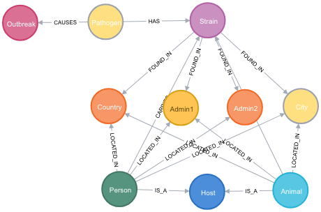

# Covid-19-Community

This project is a community effort to build a Neo4j Knowledge Graph (KG) that links heterogenous data about COVID-19 to help fight this outbreak! It serves as a sandbox and incubator project and the best ideas will be incorporated into the Covid-19-Net KG.

Join **"GraphHackers, Let’s Unite to Help Save the World — [Graphs4Good 2020](https://medium.com/neo4j/graphhackers-lets-unite-to-help-save-the-world-graphs4good-2020-fed53562b41f)"**.

What kind of data can you contribute? Here are some of our ideas.


## How can you contribute?

* File an [issue](https://github.com/covid-19-net/covid-19-community/issues/new) to discuss your idea so we can coordinate efforts

* Help with [specific issues](https://github.com/covid-19-net/covid-19-community/labels/help%20wanted)
* Suggest publically accessible data sets
* Suggest graph queries to gain new insights from the KG
* Add Jupyter Notebooks with data analyses
* Add data and map visualizations
* Help improve the data model
* Report bugs or issues


## How to use this project?
This project uses Jupyter Notebooks to download and curate the latest data files, create a Neo4j graph database, and run Cypher queries on the graph database. The results of the queries can then be used in the Jupyter Notebooks for further analysis and visualizations.

(Currently, we don't have graph visualization working in Jupyter Lab. We are looking for community members to [help](https://github.com/covid-19-net/covid-19-community/issues/1).)

You can run the Jupyter Notebooks in this repo in your web browser:

[](https://aws-uswest2-binder.pangeo.io/v2/gh/covid-19-net/covid-19-community/master?urlpath=lab)

Once Jupyter Lab launches, navigate to the notebooks folder and run the following notebooks:

|Notebook|Description|
|:-------|:----------|
|[1a-Strains](../notebooks/1-Strains.ipynb)| Downloads the latest SARS-CoV-2 strain data and creates node and relationship files in the data directory|
|1b-...|Future notebooks that add new nodes and relationship files|
|[2-CreateGraph](../notebooks/2-CreateGraph.ipynb)|Creates a Neo4j Knowledge Graph by batch-uploading the nodes and relationship files|
|[3-ExampleQueries](../notebooks/3-ExampleQueries.ipynb)| Runs [Cypher](https://neo4j.com/developer/cypher-query-language/) queries on the Knowledge Graph|


## A prototype Subgraph that represents relationships for Virus Strains



This subgraph maps the relationships between the Pathogen (SARS-CoV-2) that causes the COVID-19 disease Outbreak, the strains of the virus, the host (human or animal), and the locations where they were found.

## Data Creation and Organization
We have separated data download and curation from the graph database creation. 

1. Data Download and Curation

Jupyter Notebooks are used to download the latest raw data files, curate and harmonize the data, and then save Nodes and Relationships as .csv files in the /data directory.

The Nodes, Relationships, and their Properties are named according to these [conventions](https://neo4j.com/docs/cypher-manual/current/syntax/naming/).

The headers of the Node and Relationship .csv files must be formated according to the Neo4j [formatting rules]((https://neo4j.com/docs/operations-manual/current/tools/import/file-header-format/) for batch upload.

The graph database is created from the following files:

|Directory|Description|
|---------|-----------|
|cached_data|Raw data files downloaded from resources that do not provide download URLs. These files are manually downloaded and updated as needed.|
|reference_data|Node and Relationship .csv files that are manually created and updated|
|data|Node and Relationship .csv files created automatically by running the Jupyter Notebooks. These files are overwritten. Do not edit these files.|

2. Batch-up of Node and Relationship files

The [2-CreateGraph.ipynb](../notebooks/2-CreateGraph.ipynb) notebook [batch-uploades the .csv files](https://neo4j.com/docs/operations-manual/current/tools/import/) into an empty Neo4j database.

## How to run this project locally

1. Fork this project

A [fork](https://help.github.com/en/articles/fork-a-repo) is a copy of a repository in your GitHub account. Forking a repository allows you to freely experiment with changes without affecting the original project.

In the top-right corner of this GitHub page, click ```Fork```.

Then, download all materials to your laptop by cloning your copy of the repository, where ```your-user-name``` is your GitHub user name. To clone the repository from a Terminal window or the Anaconda prompt (Windows), run:

```
git clone https://github.com/your-user-name/covid-19-community.git
cd covid-19-community
```

2. Create a conda environment

The file `environment.yml` specifies the Python version and all packages required by the tutorial. 
```
conda env create -f environment.yml
```

Activate the conda environment
```
conda activate covid-19-community
```

3. Install Neo4j Desktop

[Download Neo4j](https://neo4j.com/download/)

Then, launch the Neo4j Browser, create an empty database, and set the password to "neo4jbinder"

4. Set Environment Variable

Set a NEO4J_HOME environment variable with the path to the database installation.

(Example path from Mac OS: /Users/username/Library/Application Support/Neo4j Desktop/Application/neo4jDatabases/database-993db298-6374-4f0a-9a9a-d0783480877a/installation-3.5.14)

5. Launch Jupyter Lab
Run the Jupyter Notebooks in order to download the latest data, create a new graph database, and then query then query the graph database.

```
jupyter lab
```

6. Browse KG in Neo4j Browser

After you create the graph database by running the Jupyter Notebooks, start the database in Neo4j Browser to interactively explore the KG.


