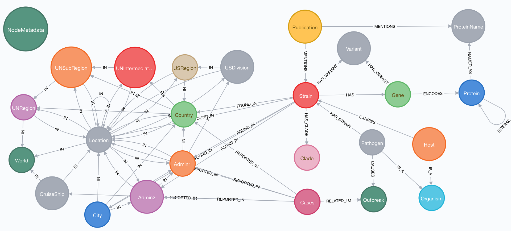

# Covid-19-Community

This project is a community effort to build a Neo4j Knowledge Graph (KG) that links heterogenous data about COVID-19 to help fight this outbreak! It serves as a sandbox and incubator project and the best ideas will be incorporated into the Covid-19-Net KG.

Join **"GraphHackers, Let’s Unite to Help Save the World — [Graphs4Good 2020](https://medium.com/neo4j/graphhackers-lets-unite-to-help-save-the-world-graphs4good-2020-fed53562b41f)"**.

What kind of data can you contribute? Here are some of our ideas.


## How can you contribute?

* File an [issue](https://github.com/covid-19-net/covid-19-community/issues/new) to discuss your idea so we can coordinate efforts

* Help with [specific issues](https://github.com/covid-19-net/covid-19-community/labels/help%20wanted)
* Suggest publically accessible data sets
* Suggest graph queries to gain new insights from the KG
* Add Jupyter Notebooks with data analyses
* Add data and map visualizations
* Help improve the data model
* Report bugs or issues

## Preliminary Knowledge Graph Schema



The left side of the schema shows the geolocation hierarchy from the world to the city level (> 1000 citizens). Geolocations are linked by COVID-19 case counts to information about host organisms, virus strains, genomes, genes, and proteins, and publications that mention the virus strains.

## Browsing the Knowledge Graph with the Neo4j Browser

You can browse the KG shown above with the Neo4j Browser

1. [Launch Browser](http://132.249.238.185:7474/)
2. Enter username: reader, password: demo
3. Click on the database icon on the top left and select database "dsc" from the menu
4. Click on any of the node labels to start exploring the KG
5. Run a [Cypher query](https://neo4j.com/docs/cypher-manual/current/introduction/)

#### Example Cypher query: aggregate cummulative COVID-19 case numbers at the US state (Admin1) level
```
MATCH (o:Outbreak{id: "COVID-19"})<-[:RELATED_TO]-(c:Cases{date: date("2020-05-04")})-[:REPORTED_IN]->(a:Admin2)-[:IN]->(a1:Admin1)
RETURN a1.name as state, sum(c.cummulativeConfirmed) as confirmed, sum(c.cummulativeDeaths) as deaths
ORDER BY deaths;
```

Note, due to data inconsistency issues in the data files from the COVID-19 Data Repository by Johns Hopkins University, not all cases can be mapped to a geolocation. Case numbers are not automatically updated, yet. Last update: 2020-05-04).

[more documentations will come soon]


## How to use this project?
This project uses Jupyter Notebooks to download and curate the latest data files, create a Neo4j graph database, and run Cypher queries on the graph database. The results of the queries can then be used in the Jupyter Notebooks for further analysis and visualizations.

(Currently, we don't have graph visualization working in Jupyter Lab. We are looking for community members to [help](https://github.com/covid-19-net/covid-19-community/issues/1).)

You can run the Jupyter Notebooks in this repo in your web browser:

[](https://aws-uswest2-binder.pangeo.io/v2/gh/covid-19-net/covid-19-community/master?urlpath=lab)

Once Jupyter Lab launches, navigate to the notebooks folder and run the following notebooks:

|Notebook|Description|
|:-------|:----------|
|[00e-GeoNamesCountry](notebooks/00e-GeoNamesCountry.ipynb)| Downloads country information from GeoNames.org|
|[00f-GeoNamesAdmin1](notebooks/00f-GeoNamesAdmin1.ipynb)| Downloads first administrative divisions (State, Province, Municipality) information from GeoNames.org|
|[00g-GeoNamesAdmin2](notebooks/00g-GeoNamesAdmin2.ipynb)| Downloads second administrative divisions (Counties in the US) information from GeoNames.org|
|[00h-GeoNamesCity](notebooks/00h-GeoNamesCity.ipynb)| Downloads city information (cities > 1000 citizens) from GeoNames.org|
|[00i-USCensusRegionDivisionState2017](notebooks/00i-USCensusRegionDivisionState2017.ipynb)| Downloads US regions, divisions, and assigns state FIPS codes from the US Census Bureau|
|[00j-USCensusCountyCity2017](notebooks/00j-USCensusCountyCity2017.ipynb)| Downloads US County FIPS codes from the US Census Bureau|
|[00k-UNRegion](notebooks/00k-UNRegion.ipynb)| Downloads UN geographic regions, subregions, and intermediate region information from United Nations|
|[01a-NCBIStrain](notebooks/01a-NCBIStrain.ipynb)| Downloads the latest SARS-CoV-2 strain data from NCBI (slow!)|
|[01b-Nextstrain](notebooks/01b-Nextstrain.ipynb)| Downloads the latest SARS-CoV-2 strain data from Nextstrain|
|[01c-NCBIRefSeq](notebooks/01c-NCBIRefSeq.ipynb)| Downloads the SARS-CoV-2 reference genome, genes, and protein products from NCBI|
|[01d-PMC-Accession](notebooks/01d-PMC-Accession.ipynb)| Downloads PubMed Central articles that mention NCBI and GISAID strains|
|[02a-JHUCases](notebooks/02a-JHUCases.ipynb)| Downloads cummulative confimed cases and deaths from the COVID-19 Data Repository by Johns Hopkins University|
|1b-...|Future notebooks that add new data to the knowledge graph|
|[2-CreateKnowledgeGraph](notebooks/2-CreateKnowledgeGraph.ipynb)|Creates a Neo4j Knowledge Graph by running the Cypher scripts in the cypher directory (does not work on Binder!)|
|[3-ExampleQueries](notebooks/3-ExampleQueries.ipynb)| Runs [Cypher](https://neo4j.com/developer/cypher-query-language/) queries on the Knowledge Graph (does not work on Binder!)|

## How to run this project locally

**1. Fork this project**

A [fork](https://help.github.com/en/articles/fork-a-repo) is a copy of a repository in your GitHub account. Forking a repository allows you to freely experiment with changes without affecting the original project.

In the top-right corner of this GitHub page, click ```Fork```.

Then, download all materials to your laptop by cloning your copy of the repository, where ```your-user-name``` is your GitHub user name. To clone the repository from a Terminal window or the Anaconda prompt (Windows), run:

```
git clone https://github.com/your-user-name/covid-19-community.git
cd covid-19-community
```

**2. Create a conda environment**

The file `environment.yml` specifies the Python version and all packages required by the tutorial. 
```
conda env create -f environment.yml
```

Activate the conda environment
```
conda activate covid-19-community
```

**3. Install Neo4j Desktop**

[Download Neo4j](https://neo4j.com/download/)

Then, launch the Neo4j Browser, create an empty database, and set the password to "neo4jbinder"

**4. Set Environment Variable**

Set a NEO4J_HOME environment variable with the path to the database installation.

(Example path from Mac OS: /Users/username/Library/Application Support/Neo4j Desktop/Application/neo4jDatabases/database-993db298-6374-4f0a-9a9a-d0783480877a/installation-3.5.14)

**5. Launch Jupyter Lab**
Run the Jupyter Notebooks in order to download the latest data, create a new graph database, and then query then query the graph database.

```
jupyter lab
```

**6. Browse KG in Neo4j Browser**

After you create the graph database by running the Jupyter Notebooks, start the database in Neo4j Browser to interactively explore the KG.


